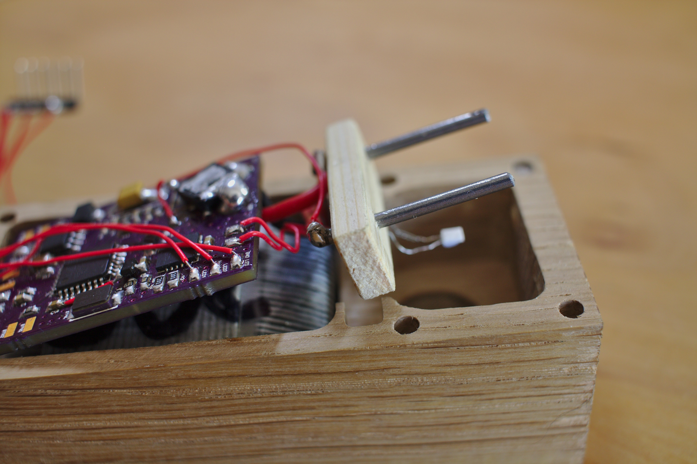

# Open Source Herbs Vaporizer
This repository contains all materials for an open source herbs vaporizer.

## Features
The goal of this project is to fulfill several requirements, commercially available products can not offer:

* **Convection based:**
Instead of heating up a bowl and transferring heat by conduction, like most cheap vaporizers, this project heats up the air and directs it onto the herbs.
This ensures that nothing gets burned and herbs are heated evenly.

* **Precise selectable temperature control:**
A PT100 temperature sensor in combination with a MAX31865 ADC ensures accurate and fast temperature readings.
The sensor is directly placed under the screen into the airflow for reading the actual temperature of the air.
The microchip controls the heat using a simple but powerful and precise PID algorithm.

* **Small and portable unit:**
The unit is as small as possible and fits easily into your pocket.
Because of it's small size, you can almost completely hide it in your palm.

* **High Power:**
The integrated LiPo Battery is capable of delivering high amounts of current and power of up to 100 watts.
Therefore, the unit can keep up with strong draws even in higher temperature settings.

* **Cheap:**
The total cost of the unit is about 20€.
Most of the components can be bought online or obtained from dead electronic devices.

* **Chargeable using your phone's USB cable:**
Since Micro-USB cables and chargers (or the newer Type-C) are readily available, the unit can be charged via USB.
Even on-the-go charging using a powerbank is possible.

* **No plastic in airflow, natural materials:**
Some vaporizers out there use plastic mouthpieces or plastic in the airflow.
The vaporizer of this project is made out of hardwood, glass and metals like stainless steel.
The heating element is a very thin nichrome wire.

## Components
### Model
The CAD model for the vaporizer can be found in [model](model/).
The CAD itself is modeled using [FreeCad](https://www.freecadweb.org/).
[EstlCAM](https://www.estlcam.de/) was used to generate the ngc files.

### Schematics and PCB layout
Schematics and the PCB layout can be found in [schematics](https://github.com/vapoduino/vape_schematics/).
You will need [EAGLE](https://www.autodesk.com/products/eagle/overview) to work with the schematics.
I used [OSHPark](https://oshpark.com/) to get my PCBs made.

### Firmware
The firmware is in [firmware](https://github.com/vapoduino/vape_firmware_arduino).
It is based on [Arduino](https://www.arduino.cc/).
For the PID algorithm, the [Ardunio PID library](https://github.com/br3ttb/Arduino-PID-Library/) is used.

## Build instructions
Check the [Wiki](https://github.com/vapoduino/vape_model/wiki) for instructions on building your own!

## Pictures
This project is in early stages, but the first working prototypes do exist:

